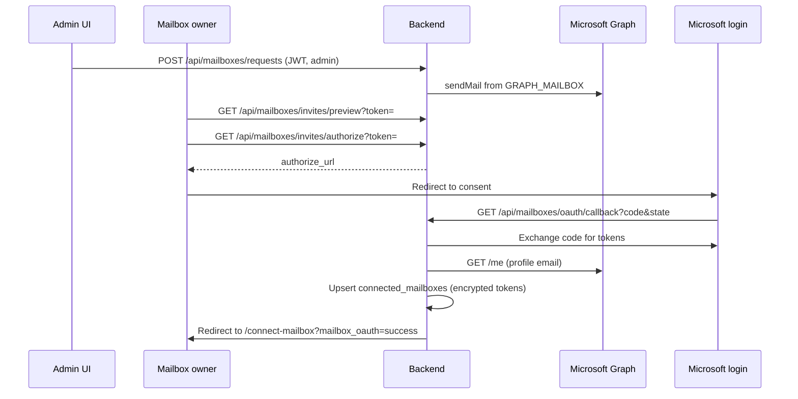

# Mailbox OAuth — Microsoft 365 delegated connection

Connect a user mailbox with **Microsoft sign-in + consent** (OAuth 2.0 authorization code flow). Each connected mailbox polls with its own delegated Graph token.

For the legacy **application-permission** service mailbox (`GRAPH_MAILBOX`), see [phase1-graph.md](./phase1-graph.md).

## When to use which mode

| Mode | How it connects | Permissions | Typical use |
|------|-----------------|-------------|-------------|
| **OAuth (delegated, invite)** | Admin sends email invite → owner opens link → **Connect with Microsoft** | Delegated `Mail.ReadWrite`, `User.Read`, `offline_access` | Production — per-user mailbox consent |
| **Application** | `GRAPH_MAILBOX` in `.env` + admin consent | Application `Mail.Read` / `Mail.ReadWrite` | Dev / single shared inbox without user login |

When OAuth env vars are set, direct `POST /api/mailboxes` is rejected — use the invite flow instead.

## Azure setup (Entra app registration)

Use the same app registration as Graph ingestion (`AZURE_TENANT_ID`, `AZURE_CLIENT_ID`, `AZURE_CLIENT_SECRET`).

### 1. Redirect URI

**Entra ID** → **App registrations** → your app → **Authentication** → **Add a platform** → **Web**:

| Environment | Redirect URI |
|-------------|--------------|
| Local dev | `http://localhost:8001/api/mailboxes/oauth/callback` |
| Staging/prod | `https://<api-host>/api/mailboxes/oauth/callback` |

Must match `GRAPH_OAUTH_REDIRECT_URI` exactly (scheme, host, port, path).

### 2. API permissions (Delegated)

**API permissions** → **Microsoft Graph** → **Delegated permissions**:

- `Mail.ReadWrite` — read mail, mark read, move to Processed / Exceptions
- `User.Read` — resolve signed-in user email from `/me`
- Under **OpenId permissions**: `openid`, `profile`, `offline_access` — sign-in + refresh token for background polling

Then click **Grant admin consent for &lt;tenant&gt;** so every row shows **Granted**.

If invite users still see **Need admin approval** while `Mail.ReadWrite` / `User.Read` already show Granted, you almost always still need the OpenId trio (`openid`, `profile`, `offline_access`) added and re-consented — LedgerLink requests those scopes on every mailbox connect.

> Application permissions for `GRAPH_MAILBOX`:
> - `Mail.Read` / `Mail.ReadWrite` — inbox polling (see [phase1-graph.md](./phase1-graph.md))
> - **`Mail.Send`** — send mailbox connection invitation emails from `GRAPH_MAILBOX`

### 3. Client secret

**Certificates & secrets** → new client secret → copy into `AZURE_CLIENT_SECRET`.

## Configure app

Add to `backend/.env` (see [backend/.env.example](../backend/.env.example)):

```env
AZURE_TENANT_ID=your-tenant-id
AZURE_CLIENT_ID=your-client-id
AZURE_CLIENT_SECRET=your-secret

GRAPH_OAUTH_REDIRECT_URI=http://localhost:8001/api/mailboxes/oauth/callback
GRAPH_OAUTH_FRONTEND_RETURN_URL=http://localhost:5173/integrations

# Public frontend URL — used in invite emails and audit CSV links
PUBLIC_APP_URL=http://localhost:5173

# Staging (AKS): set all three to your public /ledgerlink URL, or rely on AZURE_WEBAPP_URL
# PUBLIC_APP_URL=https://staging.highvolt.tech/ledgerlink
# GRAPH_OAUTH_REDIRECT_URI=https://staging.highvolt.tech/ledgerlink/api/mailboxes/oauth/callback
# GRAPH_OAUTH_FRONTEND_RETURN_URL=https://staging.highvolt.tech/ledgerlink/integrations
# AZURE_WEBAPP_URL=https://staging.highvolt.tech/ledgerlink

# Service mailbox — also used as the sender for connection invitation emails
GRAPH_MAILBOX=you@company.com
```

Run migrations **018** and **019** if not already applied:

```powershell
cd backend
alembic upgrade head
```

Invitations are sent **from `GRAPH_MAILBOX`** via Microsoft Graph (`Mail.Send` application permission). SMTP is only used as a fallback when Graph is not configured.

Restart API after changing env:

```powershell
uvicorn app.main:app --reload --port 8001
```

Frontend (separate terminal):

```powershell
cd frontend
npm run dev
```

For local testing without Graph send, run [MailHog](https://github.com/mailhog/MailHog) on port **1025**, set `SMTP_*`, and leave `GRAPH_MAILBOX` empty.

## Connect a mailbox (UI)

### Admin — send invitation

1. Sign in to LedgerLink as an admin.
2. Open **Integrations** (or **Inbox** → connect mailbox).
3. Enter the mailbox owner's email and optional message → **Send invitation**.
4. The recipient receives an email with a link to `/connect-mailbox?token=...`.

### Mailbox owner — complete OAuth

1. Open the link from the invitation email (valid for **7 days**).
2. Review the org name and requested mailbox email.
3. Click **Connect with Microsoft**.
4. Sign in with the **same Microsoft account** as the invited email and accept consent.
5. Browser returns to `/connect-mailbox?mailbox_oauth=success&email=...`.

Connected mailboxes show **OAuth** auth type and `connection_status=connected`.

> The signed-in Microsoft account must match the invited email address. Mismatches are rejected.

## OAuth flow (API)



- **Invite token** is a signed JWT (`JWT_SECRET`) binding `request_id` + `org_id` (7 day TTL).
- **OAuth state** is a signed JWT binding `org_id` + `invite_request_id` (15 min TTL).
- **Tokens** are encrypted at rest with Fernet derived from `JWT_SECRET`.
- **Refresh** happens automatically before poll when the access token is near expiry.

Legacy direct authorize (`GET /api/mailboxes/oauth/authorize`) returns **422** — use the invite flow.

## Polling

Celery Beat polls all **active, pollable** mailboxes in `connected_mailboxes`:

- OAuth mailboxes: `auth_type=delegated`, `connection_status=connected`, valid refresh token
- Application mailboxes: synced from `GRAPH_MAILBOX` env (`auth_type=application`)

Trigger an immediate poll:

```powershell
Invoke-RestMethod -Method POST http://localhost:8001/api/process/trigger
```

Check status:

- `GET /api/mailboxes` — list connected mailboxes and connection status
- `GET /api/mailboxes/requests` — pending and completed connection invitations
- `GET /api/audit-log` — `mailbox_connect_*`, `email_ingested` / `email_skipped` events

## Troubleshooting

| Symptom | Likely cause | Fix |
|---------|--------------|-----|
| 503 on create invite | Missing OAuth env | Set `AZURE_*` + `GRAPH_OAUTH_REDIRECT_URI` |
| 503 after create invite | Graph Mail.Send missing or SMTP unreachable | Add **Mail.Send** (application) + admin consent; or configure SMTP |
| Invite link 404 | Expired or completed invite | Resend from **Integrations** |
| Redirect URI mismatch | Entra URI ≠ env | Align Entra **Authentication** with `GRAPH_OAUTH_REDIRECT_URI` |
| **Need admin approval** (Microsoft login) | Org-wide **delegated** consent not granted, or user consent disabled in tenant | Global Admin opens **Integrations → Open Microsoft admin consent** (or API `GET /api/mailboxes/oauth/admin-consent-url`), accepts once, then user retries invite |
| `mailbox_oauth=error` after consent | Wrong account / revoked consent | Sign in with invited email; reconnect |
| Mailbox listed but not polling | `connection_status=error` | Read `last_error` on row or reconnect OAuth |
| 422 on POST /api/mailboxes | OAuth configured | Send a mailbox connection invitation instead |

## Security notes

- Never commit `.env` or client secrets.
- Rotate `JWT_SECRET` only with a plan — it encrypts stored refresh tokens and signs invite tokens.
- Each mailbox owner completes their own OAuth consent; tokens are scoped to that Microsoft account.
- Invite links are bearer tokens — treat emails as sensitive.

## Related docs

- [ngrok-mailbox-invite-testing.md](./ngrok-mailbox-invite-testing.md) — test invites with external users via ngrok
- [phase1-graph.md](./phase1-graph.md) — application-permission polling
- [phase6-graph-folders.md](./phase6-graph-folders.md) — Processed / Exceptions folder moves
- [azure-env-mapping.md](./azure-env-mapping.md) — full Azure → env mapping
